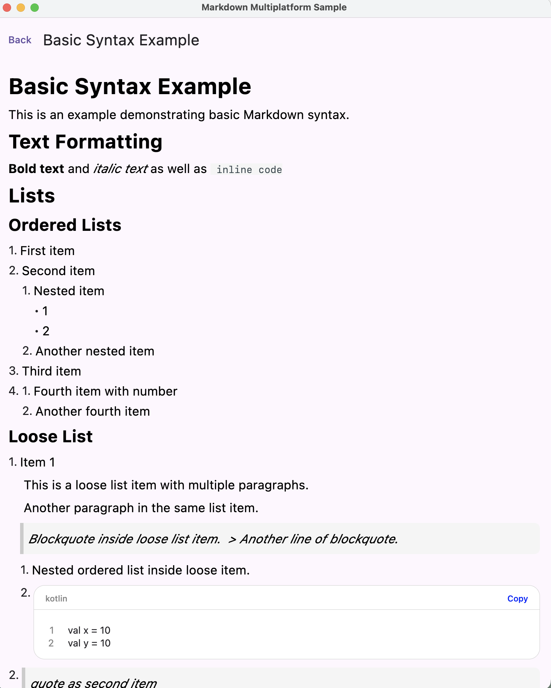
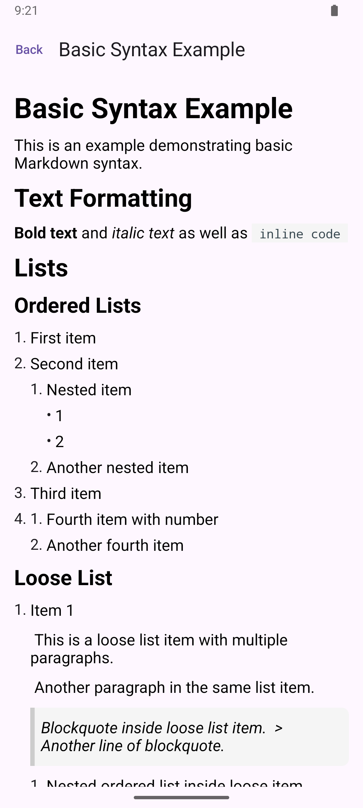
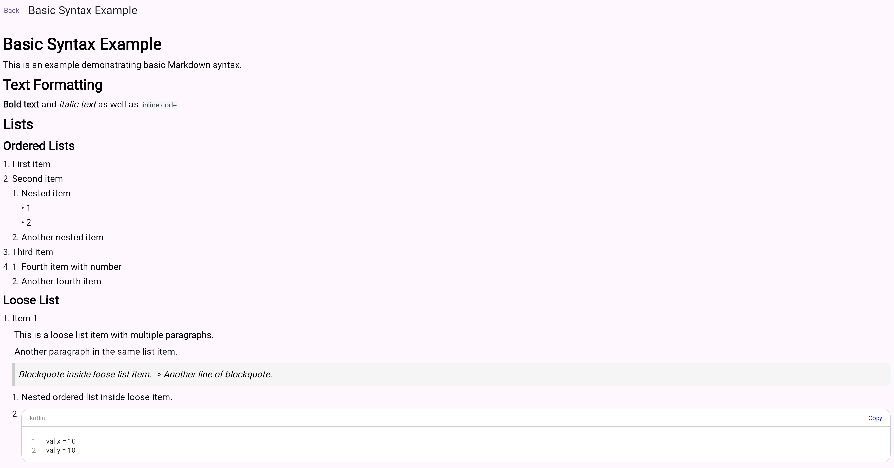

# Compose Markdown Multiplatform

[English](README.md) | [简体中文](README_zh-CN.md)

A Compose Multiplatform Markdown rendering library that supports Android, iOS, Desktop (JVM), and WebAssembly (Wasm).

> **Looking for Android-only with richer Markdown compatibility?**
> Check out [ComposeMarkdown](https://github.com/feiyin0719/ComposeMarkdown) — it offers deeper Markdown spec support (powered by Flexmark) and more rendering features for Android projects.

## Sample Screenshots

| Desktop | Android | WebAssembly (Wasm) |
| :---: | :---: | :---: |
|  |  |  |

## Features

- **Kotlin Multiplatform** — Single codebase for Android, iOS, Desktop, and Web
- **Compose Multiplatform** — Built on JetBrains Compose Multiplatform
- **CommonMark Support** — Powered by `commonmark-kotlin` parser (pure Kotlin Multiplatform)
- **Plugin System** — Modular plugin architecture for tables, images, HTML, and more; supports custom parser extensions
- **Customizable Themes** — Full control over typography, colors, and component styles
- **MarkdownText** — Text-based rendering that works like Compose `Text` with `maxLines` / `overflow` support and cross-paragraph text selection
- **LazyMarkdownView** — Incremental line loading, parsing, and bounded AST recycling for large sources
- **Async Parsing** — `MarkdownView` and `MarkdownText` overloads accept a parsing dispatcher with loading/error content
- **Streaming Parsing** — Append-only updates reparse only the previous final block until a final full parse

## Supported Platforms

| Platform | Status |
| :---: | :---: |
| Android | Supported |
| iOS (arm64, x64, simulator) | Supported |
| Desktop (JVM) | Supported |
| WebAssembly (Wasm) | Supported |

## Installation

### System Requirements

- **Kotlin**: 2.0.21+
- **Compose Multiplatform**: Latest
- **Android API**: 24+ (Android 7.0)
- **Java**: 11+

### Add Dependency

Add the dependency to your project's `build.gradle.kts`:

```kotlin
// In your shared module's build.gradle.kts
kotlin {
    sourceSets {
        val commonMain by getting {
            dependencies {
                implementation("io.github.feiyin0719:markdown-multiplatform:<version>")
            }
        }
    }
}
```

### Plugin Modules

| Plugin | Artifact | Description |
|--------|----------|-------------|
| Table | `markdown-multiplatform-table` | GFM table support |
| Image | `markdown-multiplatform-image` | Markdown image rendering |
| HTML | `markdown-multiplatform-html` | HTML inline tag support |

```kotlin
dependencies {
    implementation("io.github.feiyin0719:markdown-multiplatform-table:<version>")
    implementation("io.github.feiyin0719:markdown-multiplatform-image:<version>")
    implementation("io.github.feiyin0719:markdown-multiplatform-html:<version>")
}
```

## Quick Start

```kotlin
import io.github.feiyin0719.markdown.multiplatform.MarkdownView

@Composable
fun SimpleMarkdownExample() {
    val markdownContent = """
        # Hello Compose Markdown Multiplatform

        This is a **cross-platform** Markdown rendering library.

        - Android
        - iOS
        - Desktop
        - Web (Wasm)
    """.trimIndent()

    MarkdownView(
        content = markdownContent,
        modifier = Modifier.fillMaxSize(),
    )
}
```

### Incremental Large Documents

`LazyMarkdownView` reads a stable line source incrementally and recycles parsed nodes away from the
viewport. Stable lazy-item keys preserve the visible anchor when nodes are removed or reloaded.
It can also accept a Markdown string directly for side-by-side comparison with the Android API.

```kotlin
@Composable
fun LargeMarkdownExample(markdown: String) {
    val source = remember(markdown) { StringMarkdownLineSource(markdown) }

    LazyMarkdownView(
        source = source,
        modifier = Modifier.fillMaxSize(),
        chunkLoaderConfig = MarkdownChunkLoaderConfig(
            initialLineCount = 1000,
            incrementalLineCount = 500,
            minNodesAhead = 100,
            minNodesBehind = 30,
            maxCachedNodes = 500,
            maxCachedSourceLines = 10_000,
        ),
    )
}
```

For true lazy I/O, implement `MarkdownLineSource` with a stable file, asset, database, or range API.
The source must support rereading old ranges because scrolling backward reloads recycled nodes.
Chunk parses do not share reference-definition state; use inline links or `LazyMarkdownColumn` when
full-document reference resolution is required.

`onLoadingChanged` reports only the initial empty-screen wait. Use `onStateChanged` with
`LazyMarkdownViewState` to observe optional background before/after loading UI. AST recycling is
silent and internal concurrency uses a separate operation guard.
`maxCachedSourceLines` is also a hard limit for one unconfirmed trailing block or source context.

### Streaming Generated Content

Set `isStreaming = true` on `MarkdownView` or `MarkdownText` while text is appended at the end.
Stable prefix nodes are reused and only the previous final block is reparsed. Set
`isStreaming = false` when generation finishes to force an authoritative full parse. A custom
`StreamingMarkdownParser` can replace the default tail parser; returned tail source spans remain
relative and are rebased by the library.

```kotlin
MarkdownView(
    text = streamedMarkdown,
    parseDispatcher = Dispatchers.Default,
    isStreaming = streamInProgress,
)
```

## Tech Stack

| Technology | Purpose |
|------------|---------|
| **Compose Multiplatform** | Cross-platform UI framework |
| **commonmark-kotlin** | Markdown parsing engine (pure Kotlin Multiplatform) |
| **Kotlin Coroutines** | Asynchronous processing |
| **Material Design 3** | Design language specification |

## API Reference

For full API signatures and detailed parameter explanations, see the dedicated API document:

- **Full API Reference**: [docs/API.md](docs/API.md)

## Contributing

We welcome contributions! To get started:

1. Fork the repository
2. Create a feature branch: `git checkout -b feat/my-feature`
3. Make your changes
4. Format code: `./gradlew ktlintFormat`
5. Run checks: `./gradlew ktlintCheck`
6. Build: `./gradlew assemble`
7. Commit using conventional prefixes (`feat:`, `fix:`, `docs:`, etc.)
8. Open a Pull Request

## License

Released under the MIT License. See [LICENSE](LICENSE) for details.

---

<div align="center">

**[Back to top](#compose-markdown-multiplatform)**

Made with love by the Compose Markdown team

</div>
