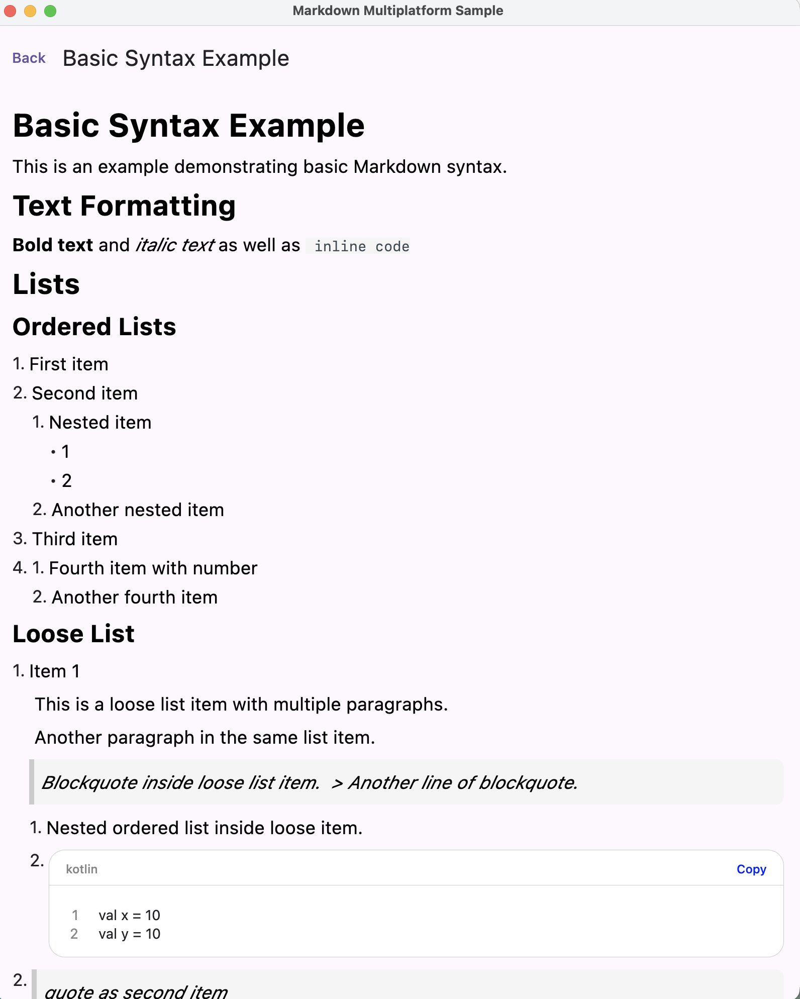
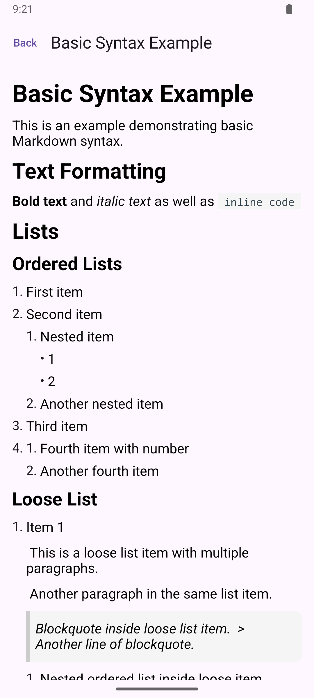
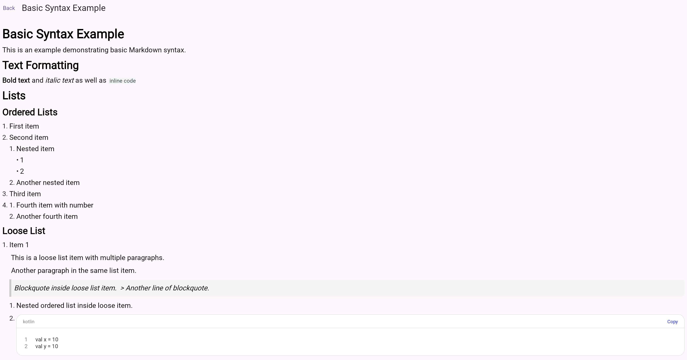

# Compose Markdown Multiplatform

[English](README.md) | [简体中文](README_zh-CN.md)

一个 Compose Multiplatform Markdown 渲染库，支持 Android、iOS、Desktop (JVM) 和 WebAssembly (Wasm)。

> **如果只需要 Android 平台和更好的 Markdown 兼容性？**
> 请使用 [ComposeMarkdown](https://github.com/feiyin0719/ComposeMarkdown) — 它基于 Flexmark 解析引擎，拥有更深入的 Markdown 规范支持和更丰富的渲染特性。

## 示例截图

| Desktop | Android | WebAssembly (Wasm) |
| :---: | :---: | :---: |
|  |  |  |

## 特性

- **Kotlin Multiplatform** — 一套代码同时支持 Android、iOS、Desktop 和 Web
- **Compose Multiplatform** — 基于 JetBrains Compose Multiplatform 构建
- **CommonMark 支持** — 使用 `intellij-markdown` 解析器（纯 Kotlin）
- **插件系统** — 模块化的插件架构，支持表格、图片、HTML 等扩展
- **可定制主题** — 完全控制排版、颜色和组件样式

## 支持的平台

| 平台 | 状态 |
| :---: | :---: |
| Android | 已支持 |
| iOS (arm64, x64, simulator) | 已支持 |
| Desktop (JVM) | 已支持 |
| WebAssembly (Wasm) | 已支持 |

## 安装

### 系统要求

- **Kotlin**：2.0.21+
- **Compose Multiplatform**：最新版本
- **Android API**：24+（Android 7.0）
- **Java**：11+

### 添加依赖

在项目的 `build.gradle.kts` 中添加依赖：

```kotlin
// 在共享模块的 build.gradle.kts 中
kotlin {
    sourceSets {
        val commonMain by getting {
            dependencies {
                implementation("io.github.feiyin0719:markdown-multiplatform:<version>")
            }
        }
    }
}
```

### 插件模块

| 插件 | Artifact | 描述 |
|--------|----------|-------------|
| 表格 | `markdown-multiplatform-table` | GFM 表格支持 |
| 图片 | `markdown-multiplatform-image` | Markdown 图片渲染 |
| HTML | `markdown-multiplatform-html` | HTML 内联标签支持 |

```kotlin
dependencies {
    implementation("io.github.feiyin0719:markdown-multiplatform-table:<version>")
    implementation("io.github.feiyin0719:markdown-multiplatform-image:<version>")
    implementation("io.github.feiyin0719:markdown-multiplatform-html:<version>")
}
```

## 快速开始

```kotlin
import io.github.feiyin0719.markdown.multiplatform.MarkdownView

@Composable
fun SimpleMarkdownExample() {
    val markdownContent = """
        # Hello Compose Markdown Multiplatform

        这是一个**跨平台** Markdown 渲染库。

        - Android
        - iOS
        - Desktop
        - Web (Wasm)
    """.trimIndent()

    MarkdownView(
        content = markdownContent,
        modifier = Modifier.fillMaxSize(),
    )
}
```

## 技术栈

| 技术 | 作用 |
|------------|---------|
| **Compose Multiplatform** | 跨平台 UI 框架 |
| **intellij-markdown** | Markdown 解析引擎（纯 Kotlin） |
| **Kotlin Coroutines** | 异步处理 |
| **Material Design 3** | 设计语言规范 |

## API 参考

关于完整函数签名和详细参数说明，请参考专门的 API 文档：

- **完整 API 参考**：[docs/API_zh-CN.md](docs/API_zh-CN.md)

## 贡献指南

欢迎贡献代码！开始之前：

1. Fork 本仓库
2. 创建特性分支：`git checkout -b feat/my-feature`
3. 完成你的修改
4. 格式化代码：`./gradlew ktlintFormat`
5. 运行检查：`./gradlew ktlintCheck`
6. 构建：`./gradlew assemble`
7. 使用约定前缀提交（`feat:`、`fix:`、`docs:` 等）
8. 提交 Pull Request

## 许可证

本项目基于 MIT License 开源发布。详情请查看 [LICENSE](LICENSE)。

---

<div align="center">

**[回到顶部](#compose-markdown-multiplatform)**

由 Compose Markdown 团队用心打造

</div>
